# Action stream

**Endpoint:** `POST /decide`  
**Entry:** `app.py` → `modules/decision_handler.py` (`handle_decision`)  
**Job:** Apply a **human** decision (approve / reject / edit) to a **stored** draft. Mock-execute only on approve. **Never re-run the LLM pipeline.**

Sister doc: [`request-stream.md`](./request-stream.md) · data shapes: [`data-flow.md`](./data-flow.md) · full system: [`architecture-validation.md`](./architecture-validation.md)

---

## 1. Where it sits in the system

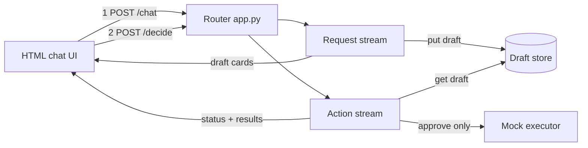

Track 3 rule: a prompt that says “ask first” is not enough — **this stream is the real gate**.

---

## 2. End-to-end flow

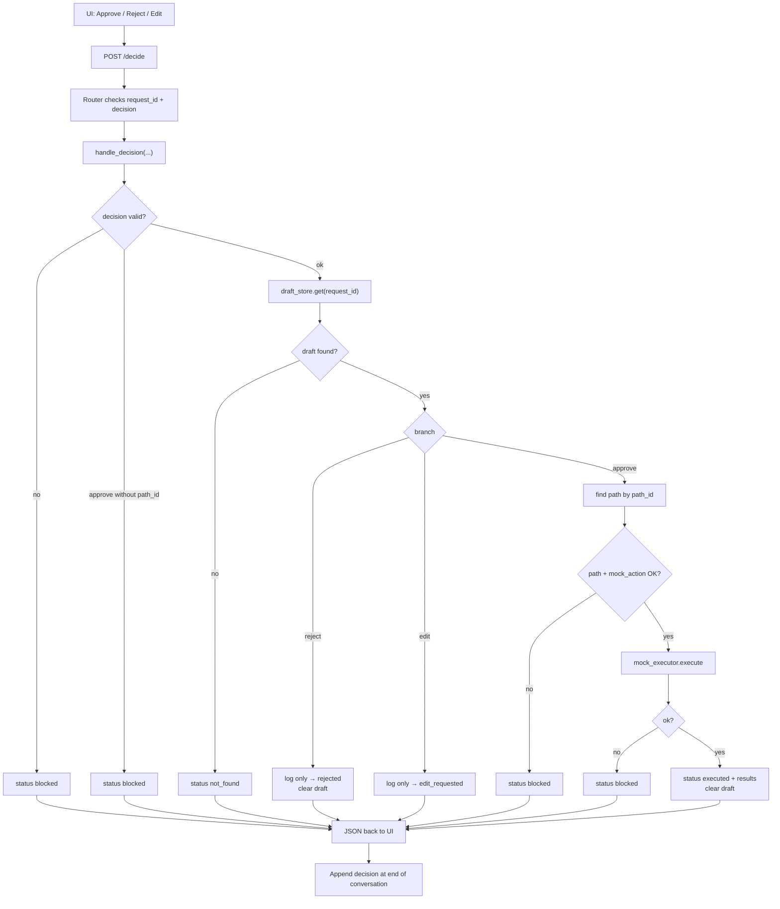

---

## 3. Sequence diagrams

### Approve (happy path)

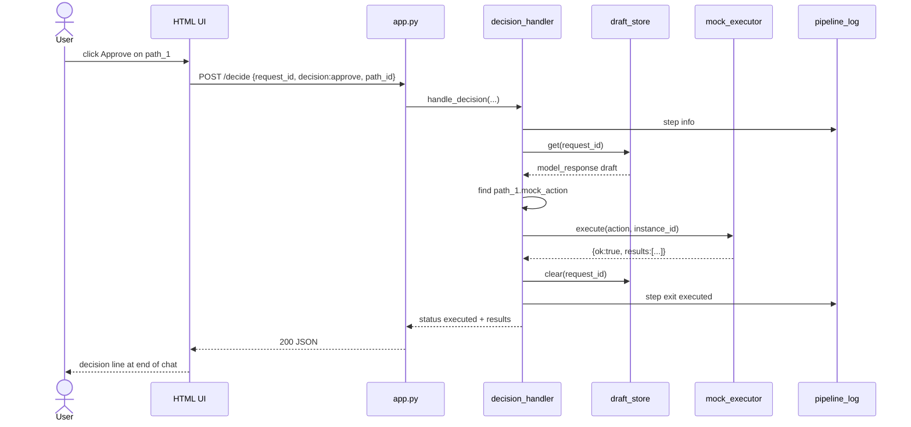

### Reject

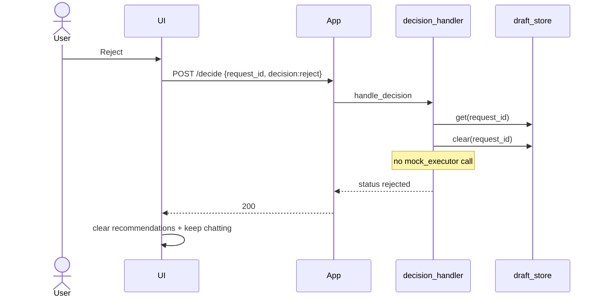

### Edit

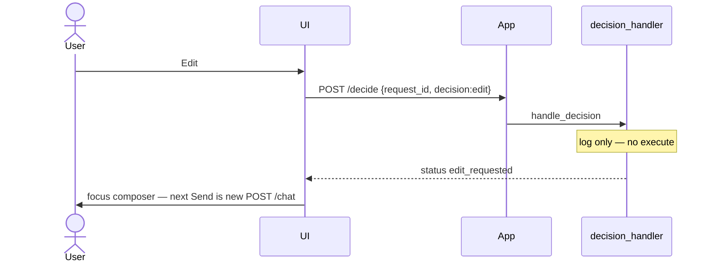

---

## 4. Modules and responsibilities

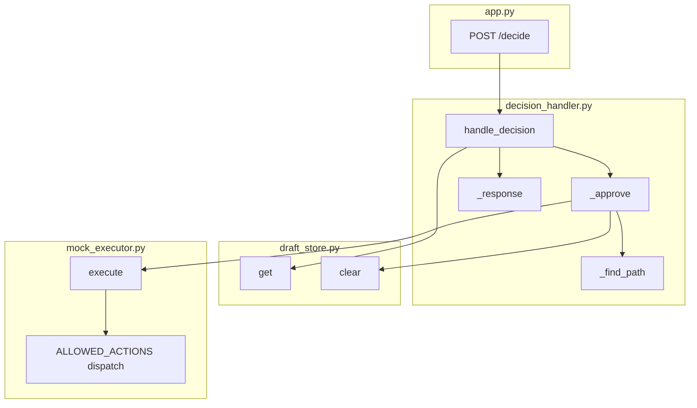

| Module | File | Role |
| --- | --- | --- |
| Router | `app.py` | Validate body; map status → HTTP code |
| Decision handler | `decision_handler.py` | HITL gate + logging |
| Draft store | `draft_store.py` | Trusted source of `mock_action` |
| Mock executor | `mock_executor.py` | Fake allowlisted cloud actions |
| Pipeline log | `pipeline_log.py` | Record human decision steps |
| Frontend | `static/script.js` | Buttons → `/decide`; append results to conversation |

**Dependency direction (keep one-way):**

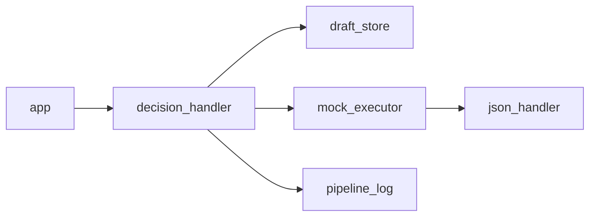

`mock_executor` reuses `ALLOWED_ACTIONS` / `BLOCKED_ACTIONS` from `json_handler` so draft validation and execution stay aligned.

---

## 5. Decision branches

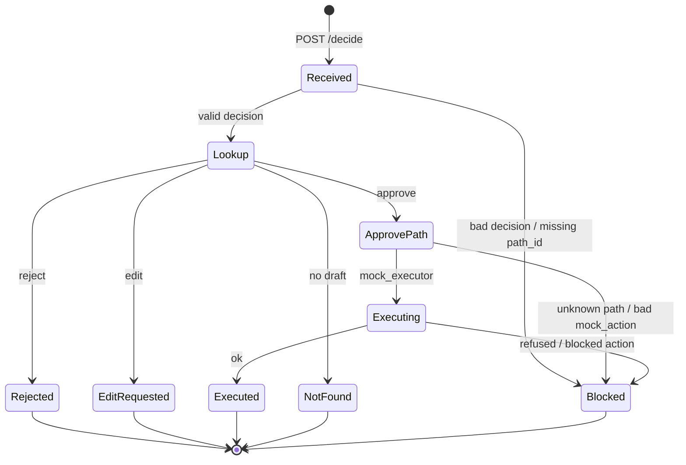

### HTTP mapping

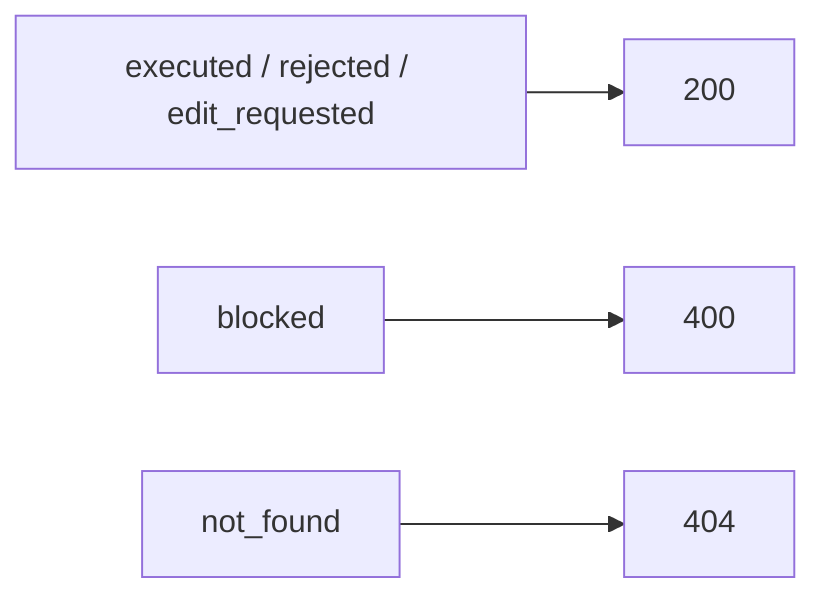

---

## 6. Data shapes

### Request body

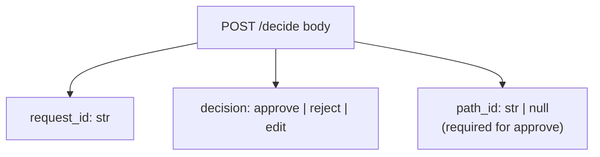

### Resolve action from store (not from browser)

```mermaid
flowchart LR
    RID[request_id] --> DS[(draft_store)]
    DS --> DRAFT[model_response]
    DRAFT --> PATHS[paths[]]
    PID[path_id] --> FIND[find matching id]
    PATHS --> FIND
    FIND --> MA["mock_action<br/>{ action, instance_id }"]
    MA --> EX[mock_executor]
```

### Response body

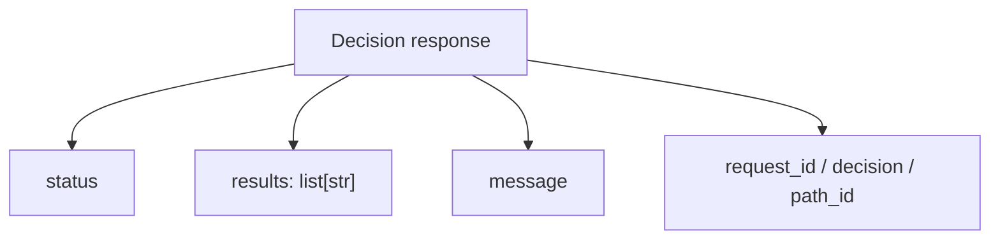

Example approve success:

```json
{
  "status": "executed",
  "results": ["stop_instance has been accomplished for i-123456789"],
  "message": "Mock action completed.",
  "request_id": "req_…",
  "decision": "approve",
  "path_id": "path_1"
}
```

---

## 7. Mock executor internals

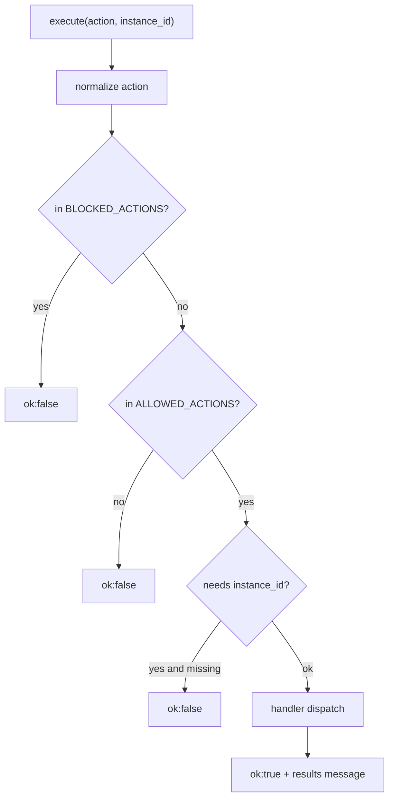

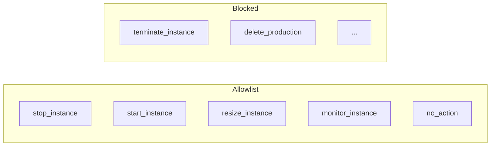

Handlers only return accomplishment **strings**. There is no real AWS SDK call.

---

## 8. Frontend contract

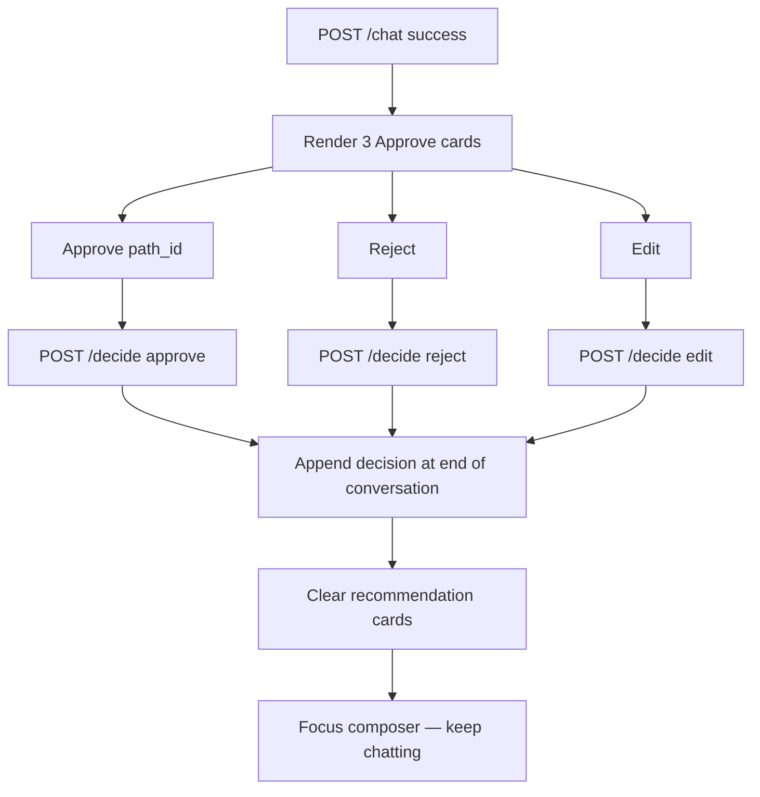

UI layout (conversation → recommendations → composer at bottom) keeps the human in a continuous chat loop after each decision.

---

## 9. Safety rules

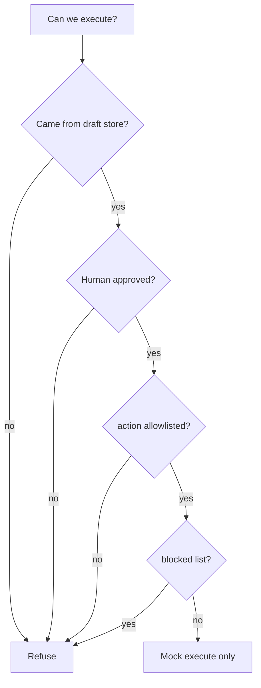

| Rule | Why |
| --- | --- |
| No LLM on `/decide` | Gate must be application code, not a prompt |
| Trust store, not client `mock_action` | Prevents forged execute payloads |
| Allowlist + blocklist | Limits blast radius of bad model output |
| Clear draft after approve/reject | Avoid double-executing the same draft |
| Log every decision | Track 3 action-log requirement |

---

## 10. How the two streams hand off

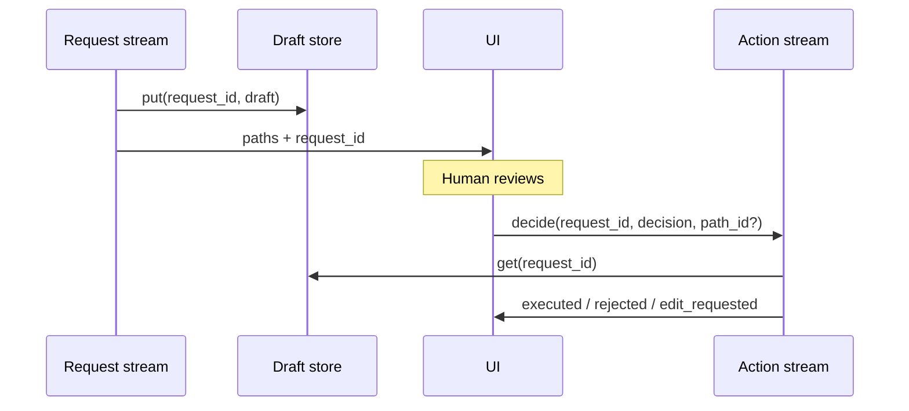

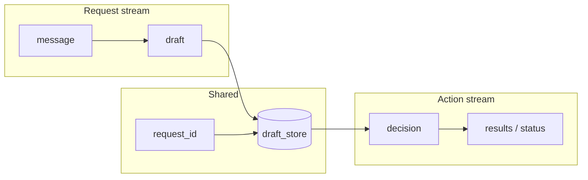

---

## 11. Demo story (action half)

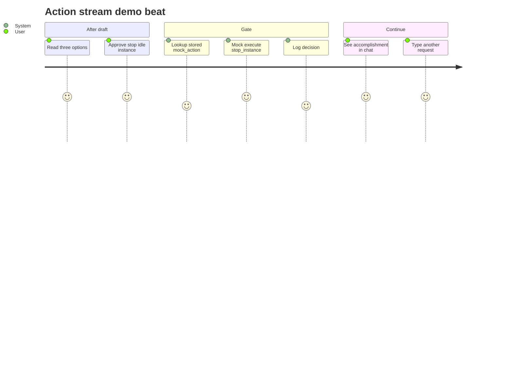

**Failure demo (optional):** ask something that yields `blocked` / empty paths in the request stream, or approve a missing `request_id` → `not_found`.

**Done signal for this stream:** Approve returns `executed` with a non-empty `results` list; Reject/Edit never call the executor; conversation can continue with a new `/chat`.
