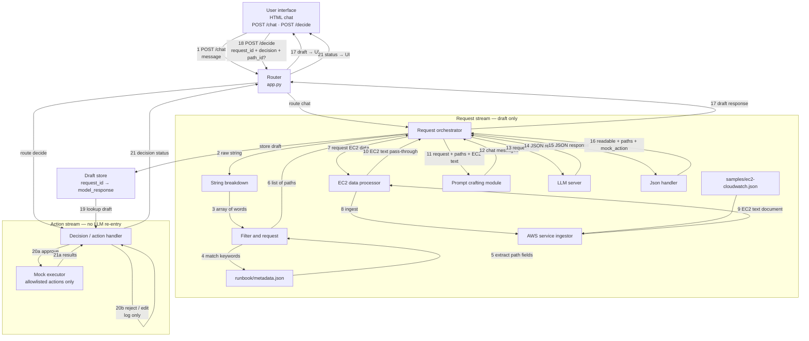

**Component diagrams**

Request stream: implemented. Action stream: planned (HITL gate).

# Code component

Modules from the diagram. Each is a callable with params → return. Request-stream modules are implemented; action-stream modules are planned.

## Shared / router

### User interface

- **Role:** send chat request; render draft (readable + 3 paths); send approve / reject / edit; show decision status
- **Status:** HTML chat exists (`templates/index.html`); HITL buttons + `/decide` wiring TBD
- **params (chat):** `message: str`
- **params (decide):** `request_id: str`, `decision: "approve" | "reject" | "edit"`, `path_id: str | None` (required for approve)
- **return:** renders draft response; then decision `status` + `results` (e.g. `"stop_instance has been accomplished for i-…"`)

### Router

- **File:** `app.py`
- **Role:** HTTP entry only — route `POST /chat` → request stream, `POST /decide` → action stream; expose health/logs
- **Endpoints:** `POST /chat`, `POST /decide`, `GET /`, `GET /health`, `GET /logs`, `GET /logs.json`, `GET /logs/<request_id>`
- **params:** request JSON bodies as above
- **return:** JSON to UI (does not run LLM inside `/decide`)

### Pipeline log

- **File:** `modules/pipeline_log.py`
- **Role:** ordered step trail per `request_id`; used by both streams
- **params:** `request_id`, `component`, `phase`, optional `detail` / `data`
- **return:** in-memory traces for `/logs`

## Request stream (draft only)

### Request orchestrator

- **File:** `modules/request_orchestrator.py` (`run_request_stream`)
- **Role:** run the draft pipeline end-to-end; store draft by `request_id` (when draft_store is wired); return UI payload (no mock execute)
- **params:** `message: str`, `request_id: str | None`
- **return:** `{ request_id, readable_response, model_response, pii_warning, paths, … }`

### String breakdown

- **File:** `modules/string_breakdown.py`
- **Role:** split a string into an array of words
- **params:** `text: str`
- **return:** `words: list[str]`

### Filter and request module

- **File:** `modules/request_filter.py`
- **Role:** match words against `runbook/metadata.json`; extract the embedded `path` from each matched record
- **params:** `words: list[str]`
- **return:** `paths: list[str]`  
(example: `["runbook/idle-ec2.md", "runbook/cost-optimization.md"]`)

### AWS service ingestor

- **File:** `modules/aws_ingestor.py`
- **Role:** read raw CloudWatch-style EC2 JSON; return EC2-only text
- **params:** `source: str` (optional path; default `samples/ec2-cloudwatch.json`)
- **return:** `ec2_text: str`

### EC2 data processor

- **File:** `modules/ec2_processor.py`
- **Role:** call ingestor; for now pass text through (filtering by hint later)
- **params:** `request_hint: str` (optional; unused in current pass-through)
- **return:** `ec2_text: str`

### Prompt crafting module

- **File:** `modules/prompt_crafter.py`
- **Role:** assemble one LLM prompt from request + runbook paths + EC2 text
- **params:**
  - `user_request: str`
  - `documents: list[str]` (runbook paths)
  - `ec2_records: str` (EC2 text document)
- **return:** chat messages `list[{ role, content }]`

### LLM server

- **File:** `modules/llm_server.py`
- **Role:** model inference (mock and/or live API)
- **params:** `prompt` as chat messages (via `call_llm` / `generate_recommendations`)
- **return:** `model_response_json: dict`  
(summary + up to 3 paths with steps, risk, pros/cons, evidence, `mock_action`)

### Json handler

- **File:** `modules/json_handler.py`
- **Role:** validate/parse model JSON; enforce allowlisted / blocked actions; UI-ready text + structure
- **params:** `model_response_json: dict | str`
- **return:** `readable_response: str` (+ full structure via `handle_model_response` / `model_response` in API)

### Draft store

- **File:** `modules/draft_store.py` (`put` / `get` / `clear`; backed by `draft_store.json`)
- **Role:** hold the last validated draft per chat turn so `/decide` does not trust the client for `mock_action`
- **params:**
  - `put(request_id, model_response)` / `get(request_id)` / optional `clear(request_id)`
- **return:** stored `model_response: dict` or `None`
- **Note:** request orchestrator calls `put` after json validation; action stream calls `get`

## Action stream (no LLM re-entry)

### Decision / action handler

- **File:** `modules/decision_handler.py` (`handle_decision` — placeholder; approve execute TBD)
- **Role:** HITL gate — resolve decision against stored draft; approve → mock execute; reject/edit → log only
- **params:**
  - `request_id: str`
  - `decision: "approve" | "reject" | "edit"`
  - `path_id: str | None` (required when `decision == "approve"`)
- **return:** `{ status: "executed" | "rejected" | "edit_requested" | "blocked" | "not_found" | "not_implemented", results: list[str], message: str, … }`

### Mock executor

- **File:** `modules/mock_executor.py` (planned)
- **Role:** run only allowlisted actions (`stop_instance`, `start_instance`, `resize_instance`, `monitor_instance`, `no_action`); never call real AWS
- **params:** `action: str`, `instance_id: str | None`
- **return:** `results: list[str]` (e.g. `["stop_instance has been accomplished for i-0abc"]`)
- **Note:** unknown / blocked actions refuse; called only after approve

# Checklist

Track: **3 — Human-in-the-Loop AI Assistant**. Source: Participant Guide (general requirements §2, Track 3 §6, submission §10).

## 1. Hackathon requirements

Applies to every track.

- [x] **Real user problem** — clearly identified user and specific problem (junior cloud/ops engineer; overwhelmed metrics / risky cloud actions).

- [x] **Supported data input** — realistic CSV, logs, documents, notes, or synthetic data (EC2 CloudWatch mock JSON + runbook docs).

- [x] **Meaningful AI assistance** — AI does a useful task (recommendations / action drafting with pros, cons, evidence).

- [x] **Visible trust or control feature** — at least one of: evidence, human approval, PII warning, confidence/risk labels, safe refusal, audit log.

- [x] **Working demonstration** — end-to-end prototype (web app / chatbot / clickable flow); not prompt-only.

- [x] **Application layer beyond the prompt** — calculations, validation, evidence, approval, privacy, logging, guardrails, or tests (not prompt alone).

- [x] **Core flow** — input → AI assistance → evidence or review → final result.

- [ ] **Demo cases** — one realistic success path and one limitation / failure / uncertainty case.

- [ ] **Architecture explainable** — simple input → processing → AI → safety → output story (architecture supports the product; it is not the product).

- [ ] **Rules compliance** — substantial work during the 48 hours; disclose pre-existing work and dependencies; public/licensed/synthetic data only; no stolen code, exposed credentials, or malicious functionality.

## 2. Track 3 requirements

Human-in-the-Loop AI Assistant — AI drafts or recommends; the **application** keeps a human in control before anything important is finalized. Mock actions and an approval queue are enough (no live Gmail/Slack/etc. required).

**Required workflow**

- [x] **1. User request** — accept a task (and optionally notes/text upload).

- [x] **2. AI draft** — generate a recommendation / draft **without** finalizing the action.

- [x] **3. Human review** — approve, edit, or reject before finalization (UI + backend gate; a prompt that says “ask first” is **not** enough).

- [x] **4. Action log** — record what the system generated and what the user decided.

**Minimum deliverable**

- [x] User enters a task or uploads notes/text.

- [x] AI generates a draft or recommendation.

- [x] User can approve, edit, or reject before finalization.

- [x] System keeps a simple action log.

- [x] One safety check: risk label, private-information warning, **or** blocked action.

**Optional advanced layers (stretch)**

- [x] Risk levels (low / medium / high) on proposed actions.

- [x] Approval rules / hard block for prohibited actions (e.g. delete production).

- [x] Guardrail checks (PII, harmful content, unsupported claims).

- [ ] Undo / rollback of an approved mock action.

- [ ] Role-based approval.

**Architecture readiness (Track 3 mapping)**

| Guide expectation | Our design                                                                     |
| ----------------- | ------------------------------------------------------------------------------ |
| User request      | `POST /chat` (+ HTML chat); optional document CRUD later                       |
| AI draft          | Request stream → mock/live LLM → 3 paths with steps, risk, pros/cons, evidence |
| Human review      | `POST /decide` → approve / edit / reject; mock execute **only** after approve  |
| Action log        | Step logs + `/logs`; must also record final human decision                     |
| Safety check      | PII warning done; risk labels in path schema; hard block TBD                   |

## 3. Submission requirements

Official form: [https://forms.gle/Yc1HKB8MeKRhVJqM7](https://forms.gle/Yc1HKB8MeKRhVJqM7)  

Soft deadline Fri Jul 31 6:00 PM · Hard deadline Sat Aug 1 10:00 AM.

**Form**

- [ ] Official submission form completed.

- [ ] Team number, project name, selected track (**Track 3**), and team-member details.

**Public GitHub repository**

- [ ] Public repo with complete final source and commit history.

- [ ] README: overview, setup, install, run, demo instructions.

- [ ] Presentation document + architecture / workflow diagram.

- [ ] Dependencies, dataset sources, and API details disclosed.

- [ ] Pre-existing components and third-party / proprietary services disclosed.

- [ ] No API keys, passwords, tokens, or confidential data committed.

**ZIP package**

- [ ] Final ZIP matches the public repo at hard deadline.

- [ ] Contains complete code, README, presentation, architecture/workflow diagram, dataset/API details, and config instructions.

**Presentation video**

- [ ] YouTube link works; video ≤ 10 minutes.

- [ ] Covers: problem, target user, solution, architecture/data flow, trust/safety feature, practical result, key limitations + working demo.

**Dataset and API rules**

- [ ] Only public, licensed, organizer-provided, participant-owned, or synthetic data.

- [ ] Dataset sources, licenses, APIs, and third-party services disclosed.

- [ ] No confidential, private, or unauthorized personal data.

- [ ] Third-party APIs (if used) disclosed; team owns terms, limits, and cost.

**Deadlines**

- [ ] Soft deadline submission optional; hard deadline submission complete before Sat Aug 1 10:00 AM.

- [ ] Final ZIP and repo reflect the version submitted for judging.