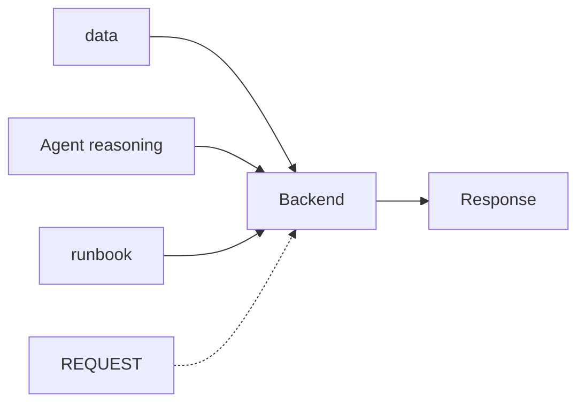
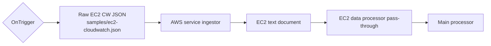
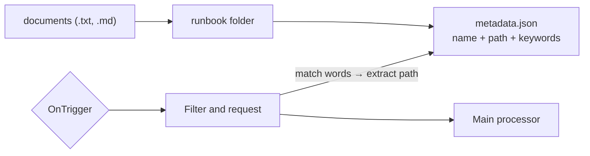
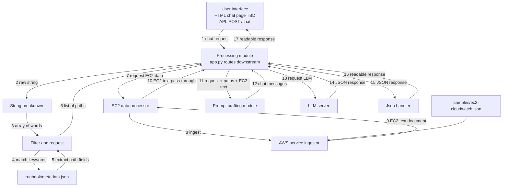

an application that takes cloud services metrics as input, and when the user request, it will support the user to decide cloud actions to do.


mock data (cloud related) + document (on handling cloud resources) + agent (reasoning) => suggestion on execution.


=> suggest 3 paths each path has several steps. => human decision


=> loop


logging appears at all steps, and private-information warning on user requests.


# Systematic visualization


**Master**




**Data**

```mermaid

erDiagram

    "RAW MOCK (CW EC2 JSON)" {

        TYPE JSON

        path samples/ec2-cloudwatch.json

    }

    "EC2 TEXT DOCUMENT" {

        TYPE TEXT

        instance_id string

        name string

        state string

        env string

        cpu_avg_24h int

        network_avg int

    }

    "RUNBOOK METADATA" {

        TYPE JSON

        path runbook/metadata.json

        name string

        file_path string

        keywords list

    }

```


PS: the pipeline focus on processing EC2 data first before extend to other services.


**Agent reasoning**

The agent should process on *selective data* and given *run book*. It should not give information out of the scope of given information.


**Mock data pipeline**




Triggering actions are user requests.


**Run book pipeline**




Allows documents of .txt and .md at first.


For lightweight hackathon: `runbook/` folder + manual `metadata.json` index. Path is embedded in each metadata record; filter only extracts matching paths.


**Model processing**

```

3 stages


1. Indexing: manually maintain runbook/metadata.json (name, path, keywords).


2. Selecting: string breakdown → word array → match keywords → return path list.


3. LLM call: bundle user request + runbook paths + EC2 text and make one call only.

```


**Component diagrams (current backend)**




## Code component


Rectangle modules from the diagram (except Processing). Each is treated as a callable with params → return.


### User interface

- **Role:** send chat request; display readable response

- **Status:** API ready (`POST /chat`); HTML chat page still TBD

- **params:** `message: str` (user text); later also `action: approve | edit | reject`

- **return:** renders `readable_response: str` (and optional structured paths for HITL controls)


### String breakdown

- **File:** `modules/string_breakdown.py`

- **Role:** split a string into an array of words

- **params:** `text: str`

- **return:** `words: list[str]`


### Filter and request module

- **File:** `modules/request_filter.py`

- **Role:** match words against `runbook/metadata.json`; extract the embedded `path` from each matched record

- **params:** `words: list[str]`

- **return:** `paths: list[str]`  

  (example: `["runbook/idle-ec2.md", "runbook/cost-optimization.md"]`)


### AWS service ingestor

- **File:** `modules/aws_ingestor.py`

- **Role:** read raw CloudWatch-style EC2 JSON; return EC2-only text

- **params:** `source: str` (optional path; default `samples/ec2-cloudwatch.json`)

- **return:** `ec2_text: str`


### EC2 data processor

- **File:** `modules/ec2_processor.py`

- **Role:** call ingestor; for now pass text through (filtering by hint later)

- **params:** `request_hint: str` (optional; unused in current pass-through)

- **return:** `ec2_text: str`


### Prompt crafting module

- **File:** `modules/prompt_crafter.py`

- **Role:** assemble one LLM prompt from request + runbook paths + EC2 text

- **params:**  

  - `user_request: str`  

  - `documents: list[str]` (runbook paths)  

  - `ec2_records: str` (EC2 text document)

- **return:** chat messages `list[{ role, content }]`


### LLM server

- **File:** `modules/llm_server.py`

- **Role:** model inference (mock now; external API later)

- **params:** `prompt` as chat messages (via `call_llm` / `generate_recommendations`)

- **return:** `model_response_json: dict`  

  (expected shape: summary + 3 paths with steps, risk, pros/cons, evidence)


### Json handler

- **File:** `modules/json_handler.py`

- **Role:** validate/parse model JSON into UI-ready text/structure

- **params:** `model_response_json: dict | str`

- **return:** `readable_response: str` (+ full structure available via `handle_model_response` / `model_response` in API)


### Processing module

- **File:** `app.py`

- **Role:** Flask router; logs every step; PII warning on requests

- **Endpoints:** `POST /chat`, `GET /health`, `GET /logs`


# Minimum Requirements


• The user enters a task or uploads notes or text: user request and document CRUD

• The AI generates a draft or recommendation: agent response

• The user can approve, edit, or reject the output before finalization: loop

• The system keeps a simple action log: logging 

• The system includes one safety check such as a risk label, private-information warning, or blocked action:


**Current coverage**

- User request via `/chat`: done

- Agent recommendation (mock LLM): done

- Action log (`/logs` + step logs): done

- PII warning (lightweight): done

- Document CRUD: still TBD

- HITL approve/edit/reject + mock action: still TBD

- Hard block for “delete production” demo: still TBD


# Idea validation


## 1. Track decision:

Track 3 - Human-in-the-Loop AI Assistant


## 2. User and problem:


1. User: Junior cloud/ops engineer managing a small AWS account


2. Problem: The information fetchable from cloud services is overwhelmed. Making a wrong decision can hurt the application operational damage, or potential security vulnerabilities. 


## 3. Input: 


- Mock CloudWatch-style EC2 JSON → EC2 text (`samples/ec2-cloudwatch.json`)


- Runbook docs under `runbook/` indexed by `runbook/metadata.json`


- User requests (e.g. "Cut cost on idle VMs")


## 4. AI and human-in-the-loop


1. AI jobs: Explain the metrics + Recommendations on action with deep pros and cons on each action


2. Human jobs: AI never executes; human approves/edits/rejects; only then a mock action runs.


3. Application: Make sure that the conversation and data transfered follow security guiderails. 


## 5. Trust / safety features 


- PII warning on requests

- Risk label per path

- Approval gate

- Action log at every step


## 6. Minimum demo script 


1. Success: idle VM -> recommend stop -> approve -> logged.


2. Failure: “delete production” / missing metrics → refuse or high-risk block.


## 7. 48 hours build plan


1. *Checkpoint 1*: 5PM30: product idea validate document ready for submission

2. *Checkpoint 2*: 9:30AM (07/31) 


# Working action

1. **DUY**: Processing module (`app.py`), wiring, runbook filter, AWS ingest path
2. **Akshita**: String breakdown, filter/request, EC2 processor, AWS ingestor (merged into current contracts)
3. **Mrunali**: Prompt crafting, LLM server (mock → live), Json handler

# Next agenda (frontend + live LLM)

## Akshita — simple HTML frontend

Build a minimal chat page that talks to the existing Flask backend.

**Scope**
- One HTML page (plus small CSS/JS if needed) served by Flask or opened against `POST /chat`
- User types a chat request and sends it to the backend
- Log the outbound request (browser console and/or on-page log panel)
- Receive the backend JSON response and display the readable result
- Log the inbound response the same way

**Out of scope for this pass**
- Full HITL approve/edit/reject UI (can be a follow-up once chat round-trip works)
- Document CRUD / runbook upload

**Done when**
- From the browser: send “Cut cost on idle EC2” → see a response from `/chat`
- Request and response both appear in a visible log

## Mrunali — live LLM server call

Replace mock-only behavior with a real model request/response path.

**Scope**
- Keep `craft_prompt` / `json_handler` as they are
- In `llm_server.py`: when mock mode is off, send the crafted messages to the LLM API and return parsed JSON
- Keep a safe fallback if the API key is missing or the call fails (error-shaped response already exists)
- Use `.env` for `OPENAI_API_KEY` (and optional `LLM_MODEL`); **never commit keys** 

**Done when**
- With a valid key and mock disabled: `/chat` returns a model-generated recommendation (not the hardcoded mock)
- With no key / API error: app still returns a clear safe error payload instead of crashing

# Remaining product gaps

1. HTML chat UI ← **Akshita (next)**
2. Live LLM call ← **Mrunali (next)**
3. HITL approve/edit/reject + mock execution after approve
4. Failure-path demo (block / high-risk for delete production)
5. Optional: load runbook file content from matched paths into the prompt
6. Optional: EC2 filtering by `request_hint` (idle / prod)
7. Document CRUD for runbooks

# Resources

- EC2 mock used by the app: `samples/ec2-cloudwatch.json`
- CloudWatch Logs Mockoon reference: https://mockoon.com/mock-samples/amazonawscom-logs/

