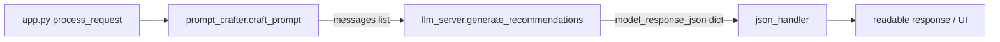
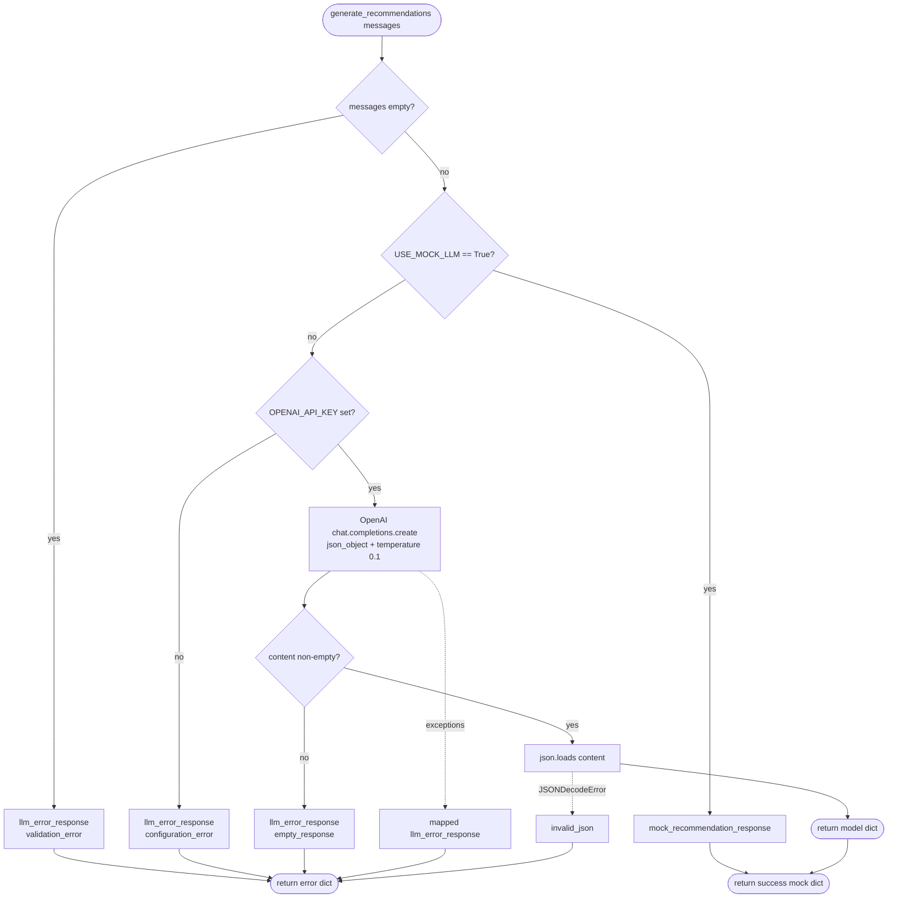
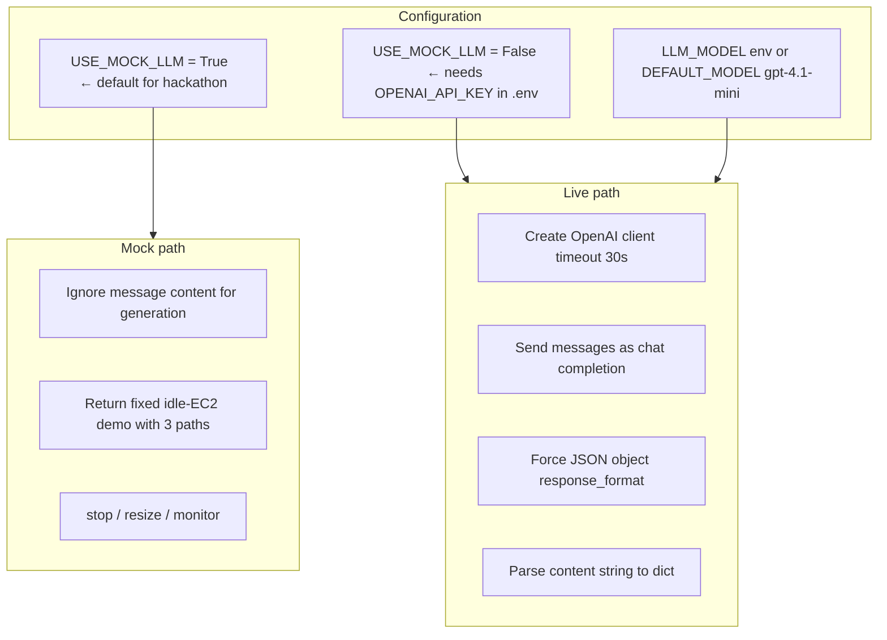
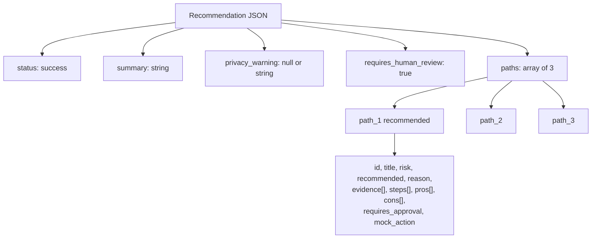
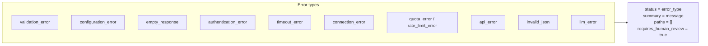
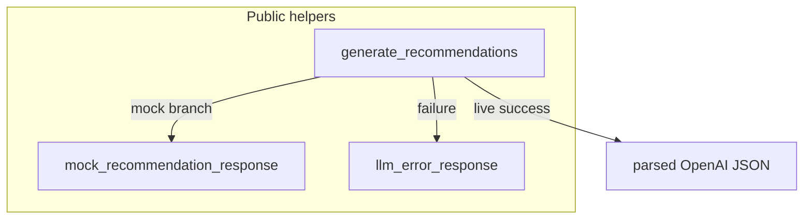
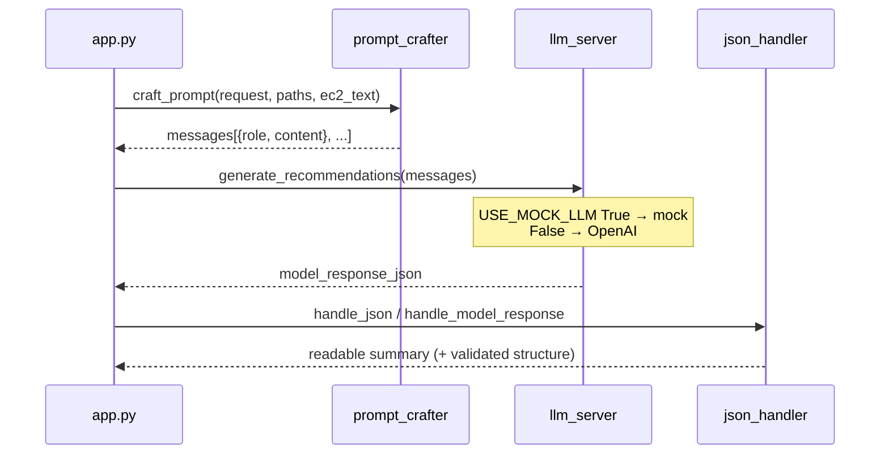

# LLM Server — how `modules/llm_server.py` works

This module turns crafted chat messages into a **recommendation JSON** object (summary + 3 paths). It can run in **mock mode** (no API cost) or **live mode** (OpenAI).

## Place in the pipeline

**Input:** `messages: list[{ "role": str, "content": str }]`  
(usually system + user messages from `prompt_crafter`)

**Output:** `dict` with at least:

- `status`
- `summary`
- `privacy_warning`
- `paths` (list of recommendation paths)
- `requires_human_review`

---

## High-level decision flow

---

## Mock vs live mode

| Mode      | When                             | Behavior                                                  |
| --------- | -------------------------------- | --------------------------------------------------------- |
| Mock      | `USE_MOCK_LLM = True`            | Always returns the same demo recommendation               |
| Live      | `USE_MOCK_LLM = False` + API key | Calls OpenAI; returns model JSON                          |
| Safe fail | Missing key / API errors         | Returns `llm_error_response(...)` — never crashes the app |

---

## Success response shape (mock / expected live)

Each `mock_action` is a **suggestion only** (e.g. `stop_instance` + `instance_id`). The LLM server does **not** execute cloud changes.

---

## Error handling map

All failures go through `llm_error_response(message, error_type)`:

| Exception / case         | `status` returned      |
| ------------------------ | ---------------------- |
| Empty `messages`         | `validation_error`     |
| No `OPENAI_API_KEY`      | `configuration_error`  |
| Empty model content      | `empty_response`       |
| `AuthenticationError`    | `authentication_error` |
| `APITimeoutError`        | `timeout_error`        |
| `APIConnectionError`     | `connection_error`     |
| `RateLimitError` (quota) | `quota_error`          |
| `RateLimitError` (other) | `rate_limit_error`     |
| `APIStatusError`         | `api_error`            |
| Bad JSON from model      | `invalid_json`         |
| Anything else            | `llm_error`            |

Downstream `json_handler` treats these statuses as safe/error responses for the UI.

---

## Functions in this file

| Function                       | Role                                           |
| ------------------------------ | ---------------------------------------------- |
| `llm_error_response`           | Build a uniform error dict                     |
| `mock_recommendation_response` | Hardcoded 3-path demo payload                  |
| `generate_recommendations`     | Main entry: validate → mock or live API → dict |

---

## How `app.py` uses it today

> Note: Some branches expose an adapter named `call_llm` that wraps `generate_recommendations`. If your local `app.py` imports `call_llm`, that adapter should call this same flow.

---

## Enabling live LLM (checklist)

1. Put `OPENAI_API_KEY=...` in a local `.env` (**do not commit**).
2. Optionally set `LLM_MODEL=...`.
3. Set `USE_MOCK_LLM = False` in `llm_server.py`.
4. Restart Flask and send a `/chat` request.
5. If the key/quota fails, you still get an error-shaped JSON (app stays up).

---

## Design intent (hackathon)

- **AI recommends only** — paths include `requires_approval` and `mock_action`; humans decide later.
- **Mock-first** — full demo without billing.
- **Fail closed on tra*n*sport** — API problems become structured errors, not stack traces to the UI.

