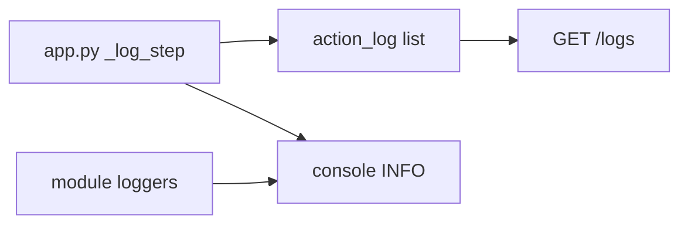
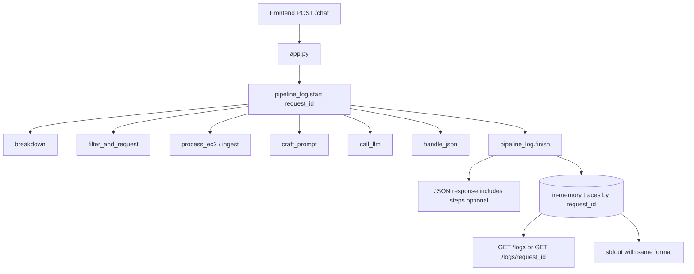
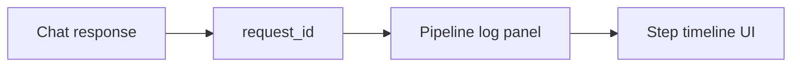

# Pipeline logging design

**Goal:** See every backend step for one chat request so we can understand how components work together — without drowning in noise.

This doc proposes a system. Implementation can follow once the team agrees.

---

## What we have today




| Piece                                         | Behavior                         | Gap                                        |
| --------------------------------------------- | -------------------------------- | ------------------------------------------ |
| `_log_step` in `app.py`                       | Records step name + short detail | Only at orchestrator; no shared request id |
| `action_log`                                  | In-memory list for `/logs`       | Flat; hard to group one chat turn          |
| Module loggers (`llm_server`, `aws_ingestor`) | Ad-hoc INFO/ERROR                | Not tied to the same request trail         |
| Frontend                                      | Shows user/AI text only          | Cannot show backend step trail             |


---


## Design principles (hackathon-scale)

1. **One request = one trace** — every step shares a `request_id`.
2. **Orchestrator owns the spine** — `app.py` logs enter/exit of each module call.
3. **Modules log internals optionally** — same `request_id`, same helper.
4. **Two sinks** — console (dev) + structured store exposed by API (demo UI / `/logs`).
5. **Safe by default** — truncate large payloads (EC2 text, prompts); never log secrets/API keys.
6. **Keep it simple** — one small helper module; no ELK/Datadog for the demo.

---


## Proposed system: request-scoped pipeline tracer




### Core idea

Add a tiny module, e.g. `modules/pipeline_log.py`, used by `app.py` (required) and other modules (optional):

```text
pipeline_log.start(request_id, message)
pipeline_log.step(request_id, component, event, detail=..., data=...)
pipeline_log.finish(request_id, status="ok"|"error")
```

`app.py` already has the right places to call this — replace / wrap `_log_step`.

---


## Event schema

Each event is one JSON-friendly object:


| Field         | Type          | Example                                                 |
| ------------- | ------------- | ------------------------------------------------------- |
| `request_id`  | str           | `"req_20260731_153001_ab12"`                            |
| `ts`          | ISO str       | `"2026-07-31T22:30:01.234Z"`                            |
| `seq`         | int           | `1`, `2`, `3`… order within the request                 |
| `component`   | str           | `string_breakdown`, `request_filter`, `aws_ingestor`, … |
| `event`       | str           | `enter`, `exit`, `info`, `warn`, `error`                |
| `detail`      | str           | Short human line                                        |
| `data`        | object | null | Small structured snapshot (truncated)                   |
| `duration_ms` | int | null    | Set on `exit` when useful                               |


### Example trail for one chat

```text
request_id=req_… seq=1  processing        enter   "Cut cost on idle EC2"
request_id=req_… seq=2  pii_check         info    no warning
request_id=req_… seq=3  string_breakdown  exit    words=5  data={words:[…]}
request_id=req_… seq=4  request_filter    exit    paths=2  data={paths:[…]}
request_id=req_… seq=5  ec2_processor     exit    ec2_text_len=617
request_id=req_… seq=6  prompt_crafter    exit    messages=2
request_id=req_… seq=7  llm_server        info    mode=mock
request_id=req_… seq=8  llm_server        exit    status=success paths=3
request_id=req_… seq=9  json_handler       exit    readable_len=82
request_id=req_… seq=10 processing        exit    status=ok duration_ms=45
```

---


## What each component should log

```mermaid
sequenceDiagram
    participant App as app.py
    participant SB as string_breakdown
    participant RF as request_filter
    participant EC as ec2_processor
    participant PC as prompt_crafter
    participant LLM as llm_server
    participant JH as json_handler

    App->>App: start(request_id)
    App->>SB: breakdown(text)
    App->>App: step exit words
    App->>RF: filter_and_request(words)
    App->>App: step exit paths
    App->>EC: process_ec2(hint)
    Note over EC: optional: ingest source path
    App->>App: step exit ec2_text_len
    App->>PC: craft_prompt(...)
    App->>App: step exit message_count
    App->>LLM: call_llm(messages)
    Note over LLM: mock vs live; errors
    App->>App: step exit status + path_count
    App->>JH: handle_json(...)
    App->>App: step exit readable_len
    App->>App: finish(request_id)
```


| Component        | Minimum (orchestrator)    | Nice-to-have (inside module) |
| ---------------- | ------------------------- | ---------------------------- |
| PII check        | warning text or “clean”   | —                            |
| String breakdown | word list (or count)      | —                            |
| Request filter   | matched paths             | “no metadata match”          |
| EC2 / ingest     | text length + source file | file-not-found error         |
| Prompt crafter   | message count             | rejected sensitive input     |
| LLM server       | mock/live + status        | API error type               |
| Json handler     | readable length / status  | blocked path count           |
| Human action     | approve/edit/reject       | —                            |


**Do not log full prompts or full EC2 text to the UI by default** — put length + optional “preview first 200 chars” behind a debug flag.

---


## Where humans see the trail


### 1. Terminal (always)

Same events printed as:

```text
15:40:11 [INFO] [req_ab12 #3] string_breakdown | exit | words=['cut','cost',...]
```


### 2. API

Extend existing logging endpoints:


| Endpoint                                                                                                  | Purpose                                                   |
| --------------------------------------------------------------------------------------------------------- | --------------------------------------------------------- |
| `GET /logs`                                                                                               | Recent events (newest first) or list of request summaries |
| `GET /logs/<request_id>`                                                                                  | Full ordered trail for one chat                           |
| Optional: include `request_id` + `steps` in `POST /chat` response when `?debug=1` or body `"debug": true` |                                                           |


### 3. Frontend (optional second pass)

A collapsible **“Pipeline log”** panel under the chat that renders `steps[]` from the chat response or polls `/logs/<id>`.




---


## Suggested code layout

```text
modules/pipeline_log.py     # start / step / finish / get_trace / get_recent
app.py                      # create request_id; wrap each module call
modules/*.py                # optional: logger = getLogger; or pipeline_log.step
documents/logging.md        # this design
```

Keep `action_log` compatible by having `pipeline_log` append the same shape (plus `request_id` / `seq`), so `/logs` keeps working.

---


## Implementation phases


### Phase 1 — Spine (do this first)

- Add `request_id` per `/chat`
- Upgrade `_log_step` → shared helper with schema above
- Console + `/logs` show grouped steps
- Return `request_id` in `/chat` JSON


### Phase 2 — Module detail

- `llm_server`: log mock vs live + error status into the same trail
- `aws_ingestor`: log source path / failure
- `prompt_crafter`: log rejection reasons


### Phase 3 — Demo UI

- Show pipeline steps on the HTML page
- Optional debug toggle for previews

---


## Config knobs


| Knob                               | Default | Meaning                             |
| ---------------------------------- | ------- | ----------------------------------- |
| `PIPELINE_LOG_LEVEL`               | INFO    | Filter noise                        |
| `PIPELINE_LOG_PREVIEW_CHARS`       | 200     | Max preview length for large fields |
| `PIPELINE_LOG_MAX_TRACES`          | 50      | Cap in-memory traces (hackathon)    |
| `PIPELINE_LOG_INCLUDE_IN_RESPONSE` | false   | Attach `steps` to `/chat` body      |


---


## Success criteria

You can answer, for any single chat:

1. Which modules ran, in what order?
2. What did each produce (words, paths, EC2 size, LLM status)?
3. Where did it fail if something broke?
4. How does that connect to the final `readable_response`?

---


## Decision for the team

**Recommended default:** Phase 1 only for the demo — orchestrator spine + `request_id` + `/logs` + optional `steps` in response. That already explains component collaboration without rewriting every module.