# Request stream

**Endpoint:** `POST /chat`  
**Entry:** `app.py` → `modules/request_orchestrator.py` (`run_request_stream`)  
**Job:** Turn a user message into an AI **draft** (recommendations only). **No cloud action is executed here.**

Sister doc: [`action-stream.md`](./action-stream.md) · data shapes: [`data-flow.md`](./data-flow.md) · full system: [`architecture-validation.md`](./architecture-validation.md)

---

## 1. Where it sits in the system

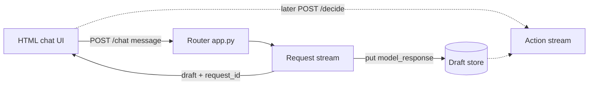

The request stream **proposes**. The action stream **finalizes** (after a human clicks).

---

## 2. End-to-end flow

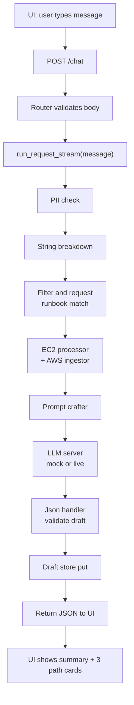

---

## 3. Sequence (who calls whom)

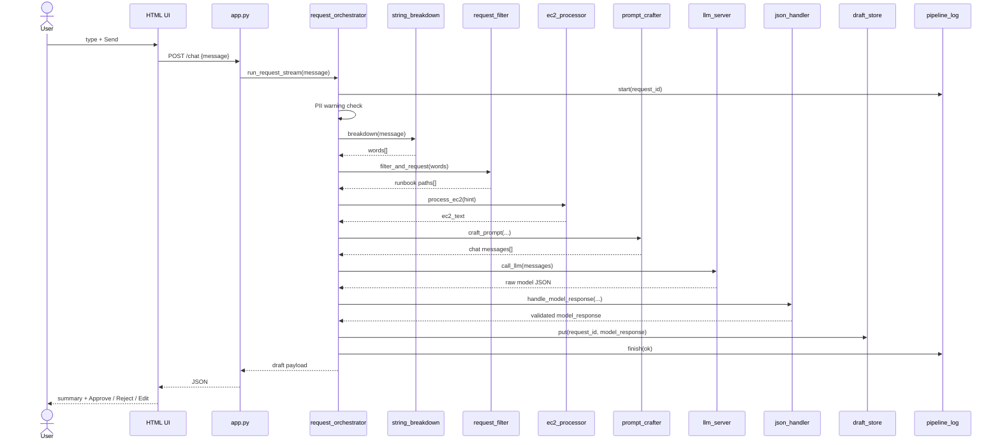

---

## 4. Modules and responsibilities

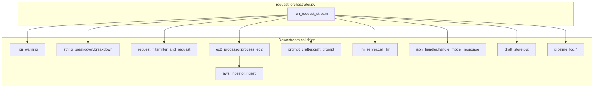

| Module | File | Input | Output |
| --- | --- | --- | --- |
| Router | `app.py` | `{ message }` | HTTP JSON draft |
| Orchestrator | `request_orchestrator.py` | `message`, optional `request_id` | full draft payload |
| String breakdown | `string_breakdown.py` | `str` | `list[str]` words |
| Filter / request | `request_filter.py` | words | runbook path list |
| EC2 processor | `ec2_processor.py` | hint | `ec2_text` |
| AWS ingestor | `aws_ingestor.py` | JSON sample path | EC2 text |
| Prompt crafter | `prompt_crafter.py` | request + paths + EC2 | chat messages |
| LLM server | `llm_server.py` | messages | raw recommendation JSON |
| Json handler | `json_handler.py` | raw JSON | validated draft |
| Draft store | `draft_store.py` | `request_id`, draft | persisted for `/decide` |
| Pipeline log | `pipeline_log.py` | steps | `/logs` trail |

---

## 5. Data shape at each station

Example user message: **“Cut cost on idle EC2”**.

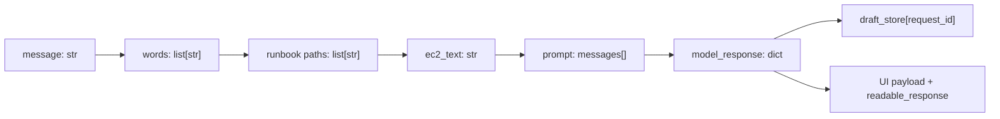

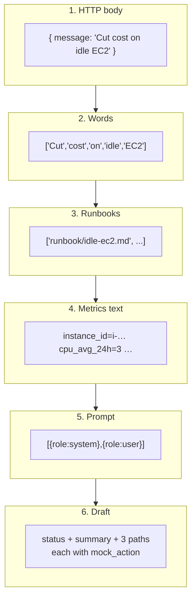

### Draft path shape (what HITL will approve later)

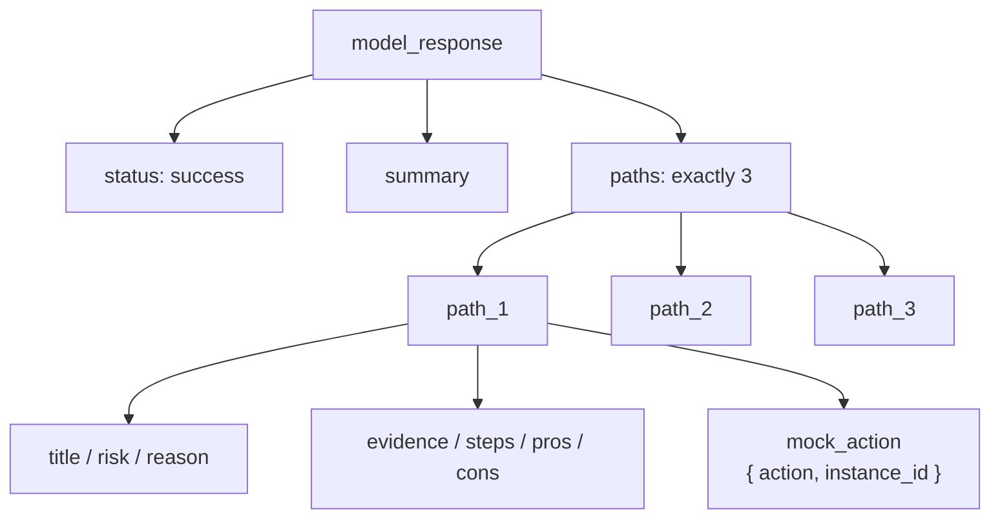

Allowlisted `mock_action.action` values (validated here, executed only in the action stream):

`stop_instance` · `start_instance` · `resize_instance` · `monitor_instance` · `no_action`

---

## 6. Safety inside the request stream

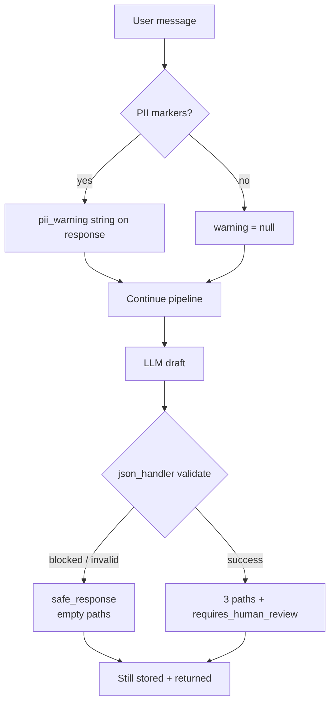

Important: even a successful draft is **not** an execution. The prompt and product rule are: recommendations only until `/decide`.

---

## 7. Logging spine

```mermaid
flowchart LR
    start[pipeline_log.start] --> s1[pii_check]
    s1 --> s2[string_breakdown]
    s2 --> s3[request_filter]
    s3 --> s4[ec2_processor]
    s4 --> s5[prompt_crafter]
    s5 --> s6[llm_server]
    s6 --> s7[json_handler]
    s7 --> s8[draft_store]
    s8 --> fin[pipeline_log.finish]
    fin --> logs["GET /logs /logs/request_id"]
```

Every step shares one `request_id` so demos can show the full trail.

---

## 8. What this stream does **not** do

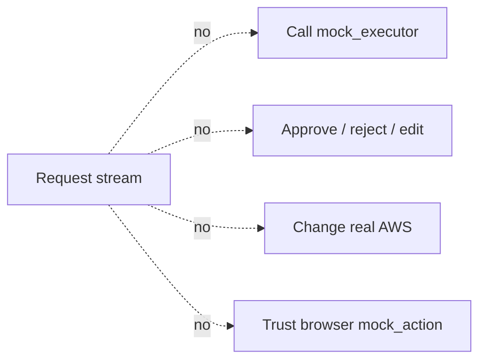

Those belong to the [action stream](./action-stream.md).

---

## 9. Demo story (request half)

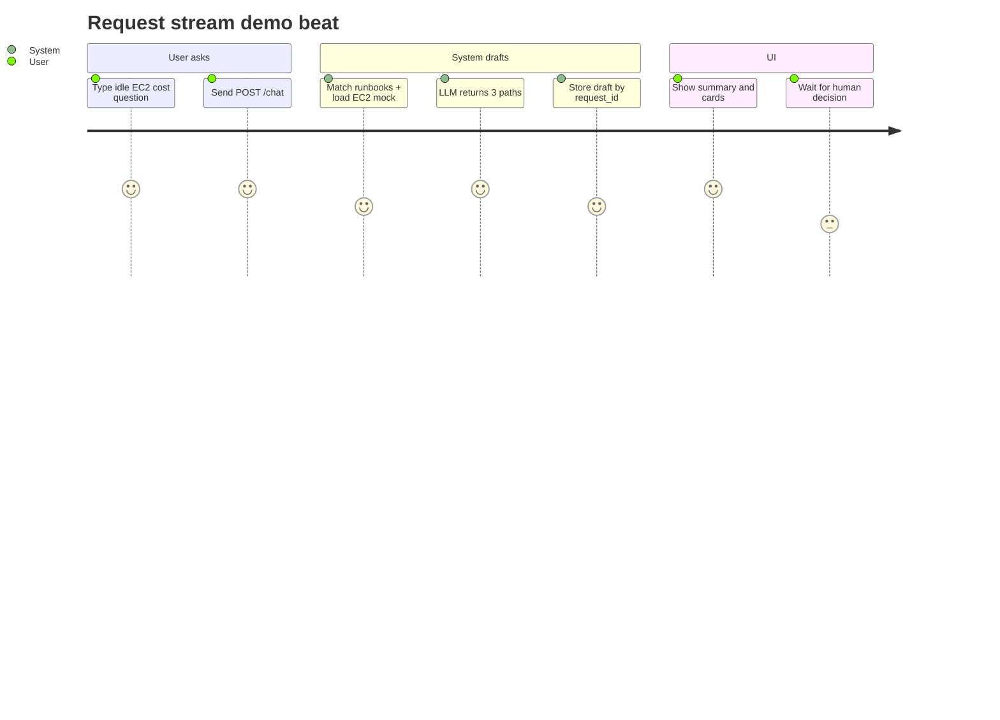

**Done signal for this stream:** UI receives `request_id`, `readable_response`, and `model_response.paths` with three options — and `draft_store.get(request_id)` returns the same draft.
