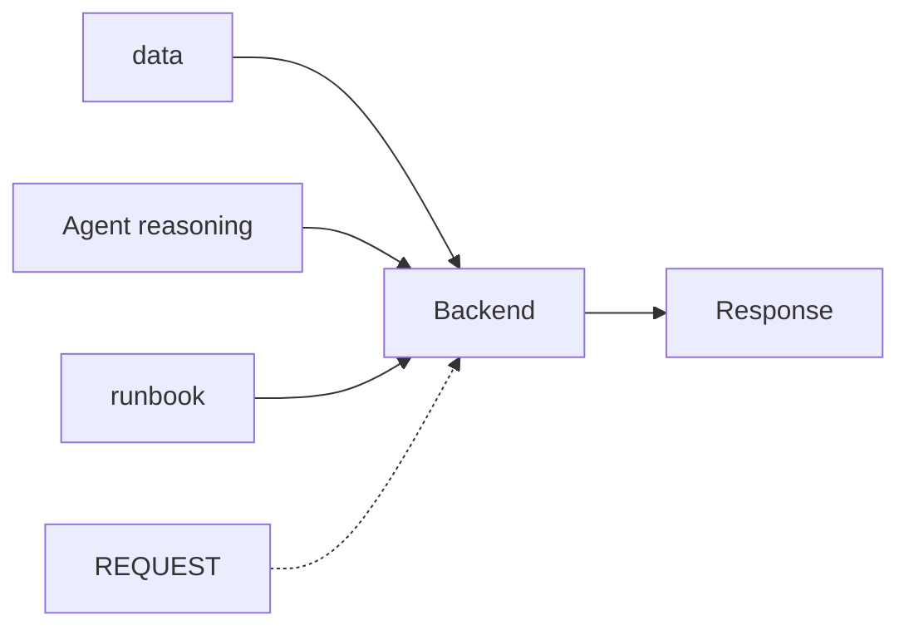
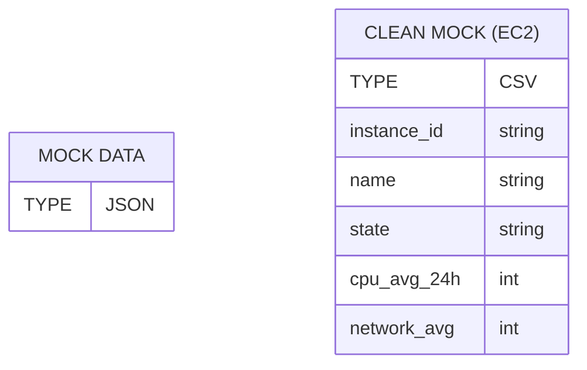
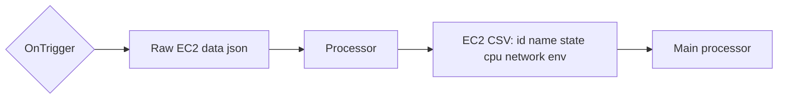
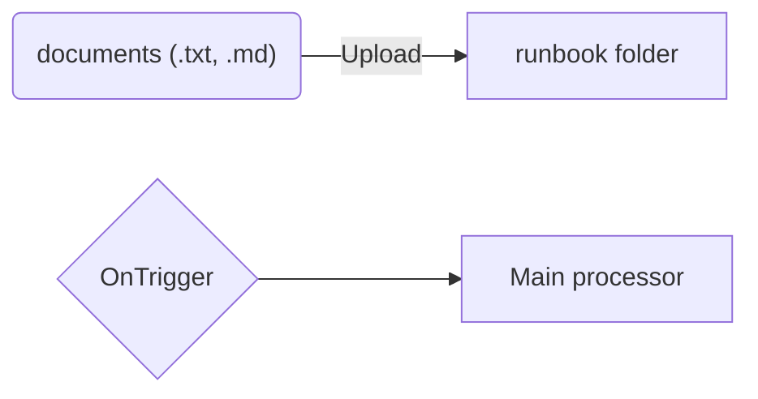
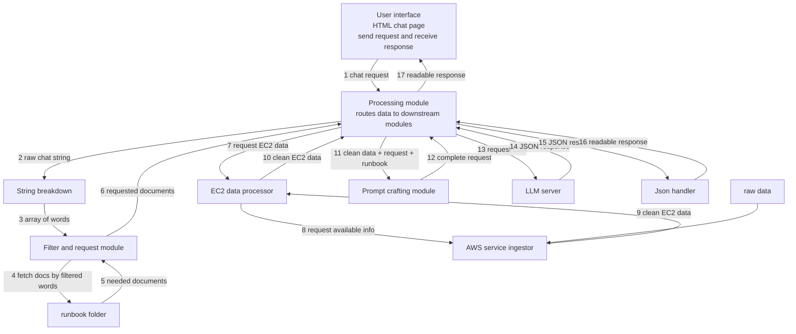

an application that takes cloud services metrics as input, and when tthe user request, it will support the user to decide cloud actions to do.

mock data (cloud related) + document (on handling cloud resources) + agent (reasoning) => suggestion on execution.

=> suggest 3 paths each path has several steps. => human decision

=> loop

loggin appears at all steps, and private-information warning on user requests.

# Systematic visualization

**Master**


**Data**


PS: the pipeline focus on processing EC2 data first before extend to other services.

There should be a middle component to handle data transformation

**Agent reasoning**
The agent should process on *selective data* and given *run book*. It should not give information out of the scope of given information.

**Mock data pipeline**


Triggering actions are user requests.

**Run book pipeline**

Allows documents of .txt and .md at first.

For lightweight hackathon, folder that stores runbook is good enough

**Model processing**
```
3 stages

1. Create metadata for the the runbook so that the main process can easily look for the dedicated documents at minimum effort.

2. Process user request, fast and light weight model to collect important and related words that can support documents extraction.

3. Bundle request, documents (necesary) and EC2 information and make API request to the model
```

=> Refinement:

1. Indexing: manually index metadata for the stored runbook

2. Selecting: Directly filter out documents by words from the request.

3. LLM call: bundle everything and make one call only.

**Component diagrams (first stage of the project)**


## Code component

Rectangle modules from the diagram (except Processing). Each is treated as a callable with params → return.

### User interface
- **Role:** send chat request; display readable response
- **params:** `message: str` (user text); later also `action: approve | edit | reject`
- **return:** renders `readable_response: str` (and optional structured paths for HITL controls)

### String breakdown
- **Role:** tokenize raw chat into filterable terms
- **params:** `raw_chat: str`
- **return:** `words: list[str]`

### Filter and request module
- **Role:** use words to select relevant runbook docs
- **params:** `words: list[str]`
- **return:** `documents: list[RunbookDoc]`  
  (`RunbookDoc`: `{ name: str, path: str, content: str }`)

### EC2 data processor
- **Role:** ask ingestor for raw EC2 info; normalize to clean CSV-shaped records
- **params:** `request_hint: str` (optional filters from user intent, e.g. idle / prod)
- **return:** `ec2_records: list[EC2Record]`  
  (`EC2Record`: `{ instance_id, name, state, cpu_avg_24h, network_avg, env }`)

### AWS service ingestor
- **Role:** read available EC2 source (mock JSON / API stub)
- **params:** `source: str` (path or mock endpoint id)
- **return:** `raw_ec2_payload: dict | list`

### Prompt crafting module
- **Role:** assemble one LLM prompt from request + runbooks + EC2 facts
- **params:**  
  - `user_request: str`  
  - `documents: list[RunbookDoc]`  
  - `ec2_records: list[EC2Record]`
- **return:** `prompt: str` (or `{ system: str, user: str }`)

### LLM server
- **Role:** model inference (external API)
- **params:** `prompt: str` (or chat messages)
- **return:** `model_response_json: dict`  
  (expected shape: summary + 3 paths with steps, risk, pros/cons, evidence)

### Json handler
- **Role:** validate/parse model JSON into UI-ready text/structure
- **params:** `model_response_json: dict | str`
- **return:** `readable_response: str` (+ optional `paths: list[PathDraft]` for approve/edit/reject)

# Minimum Requirements

• The user enters a task or uploads notes or text: user request and document CRUD
• The AI generates a draft or recommendation: agent response
• The user can approve, edit, or reject the output before finalization: loop
• The system keeps a simple action log: logging 
• The system includes one safety check such as a risk label, private-information warning, or blocked action:


# Idea validation

## 1. Track decision:
Track 3 - Human-in-the-Loop AI Assistant

## 2. User and problem:

1. User: Junior cloud/ops engineer managing a small AWS account

2. Problem: The information fetchable from cloud services is overwhelmed. Making a wrong decision can hurt the application operational damage, or potential security vulnerabilities. 

## 3. Input: 

- Mock CloudWatch-style metrics CSV/JSON

- Optional runbook docs (user can update their own reference)

- User requests (e.g. "Cut cost on idle VMs")

## 4. AI and human-in-the-loop

1. AI jobs: Explain the metrics + Recommendations on action with deep pros and cons on each action

2. Human jobs: AI never executes; human approves/edits/rejects; only then a mock action runs.

3. Application: Make sure that the conversation and data transfered follow security guiderails. 

## 5. Trust / safety fetures 

- PII warning on requests
- Risk label per path
- Approval gate
- Action log at every step

## 6. Minimum demo script 

1. Success: idle VM -> recommend stop -> approve -> logged.

2. Failure: “delete production” / missing metrics → refuse or high-risk block.

## 7. 48 hours build plan

1. *Checkpoint 1*: 5PM30: product idea validate document ready for submission
2. *Checkpoint 2*: 9:30AM (07/31) 

# Working action

1. **DUY**: Handle processing module (Flask app)
2. **Akshita**: Handle modules: String breakdown, Filter and request module, EC2 data processor, AWS service ingestor
3. **Mrunali**: Handle modules: Prompt crafting module, LLM server, Json handler


# Resouces

Mock files for AWS CloudWatch: https://mockoon.com/mock-samples/amazonawscom-logs/